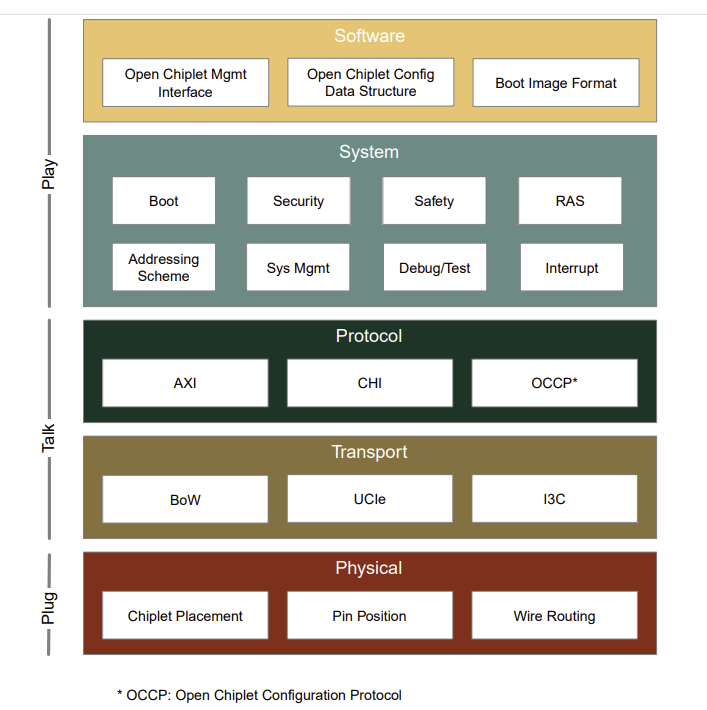

概要
====

チップレットは、個別のコンポーネントとして機能するように設計された小型の特殊集積回路である。

チップレットはインテグレーションされ、特に高レベルなソフトウェアの観点から、従来のモノリシックシステムと同様に動作するシステム・イン・パッケージ(SiP)を形成する。

従来のモノリシック集積回路では全ての機能が単一のシリコン基板上に製造されるのに対し、チップレットは個別に設計・製造・組み立てが可能である。

このアプローチにより、柔軟性の向上、歩留まりの改善、コスト効率の向上、市場投入までの時間短縮が実現される。

チップレットの相互運用性に関する課題
------------------------------------

チップレットベースのSiPは利点を提供する一方で、SiP開発、特に様々なチップレット間の相互運用性において新たな課題をもたらしている。

その利点を実現するためには、チップレットインターフェースの標準化と相互運用性の確保が必要であり、その必要性が高まっている。

-  **相互接続**:チップレットは、物理層、トランスポート層、プロトコル層を含む全層にわたる接続と効率的な通信を確立する必要がある。位置ずれは通信障害を引き起こす。高速性、低遅延、エネルギー効率、パッケージング実現性、コストなどの要素を考慮する必要がある。
-  **アドレス指定**:チップレットはアドレスマップとオンチップネットワークを独立して定義するため、アドレスマップの重複は避けられない。これにより、異なるアドレスマップ由来のアドレスを解釈しトラフィックを適切にルーティングする必要があるため、チップレット間メモリアクセスに課題が生じる。単一トランザクションが複数のチップレットを経由して目的地に到達する場合、状況はさらに複雑化する。
-  **ブート**:
   一部のチップレットは独立したブート・ソリューションを持っているが、大半は初期ブート設定、ファームウェア/ソフトウェアのロード、ブート・ステータス報告のために他のチップレットに依存している。これにより、異なるベンダーのチップレット間で通信、ブート設定、ブートフローの整合性が求められる。
-  **システム管理**:チップレットの状態、コンポーネント状態、電力、電圧、クロック、リセット、パフォーマンスなどに関するシステム管理コマンドは、チップレット間で伝達され、タイムリーかつ正確に処理される必要がある。熱制御ループや電流制御ループなどのシステム管理制御ループは、複数のチップレットにまたがる可能性がある。チップレットは、標準インターフェースを使用してシステム管理エージェント間の通信を可能にする必要がある。制御ループのタスク分割も、階層性とレイテンシを考慮しながらシームレスである必要がある。
-  **セキュリティ**:チップレットは異なるセキュリティアーキテクチャを持ち、セキュアブート、セキュリティドメイン、セキュアライフサイクル制御、システム/アプリケーションセキュリティサポートの定義が異なる場合がある。これらの差異は、整合性の欠如がセキュリティ脆弱性を引き起こす可能性があるため、シームレスなインテグレーションの障壁となる。さらに、一部のセキュリティ・アプリケーションは複雑なチップレット間連携を必要とする。例えば、SiP内のデバイス認証は階層的な認証構造につながる可能性があり、チップレット間のセキュリティメカニズムの不一致によりデバイス認証を複雑化させる。
-  **割り込み**:チップレットは相互通知に割り込みを依存する。この割り込みの実装の違いにより課題が生じる。メッセージベースとワイヤベースといった割り込みタイプの差異、ペイロード形式・ルーティング機構・ソース設定の違いが非互換性を招く。慎重な調整を行わないと、これらの不一致はシームレスな通信とシステムインテグレーションを阻害する。
-  **デバッグとテスト**:パッケージ内の全チップレットはデバッグ・テスト支援を必要とする。しかし外部デバッグ/テストアクセスポートを全てのチップレットが備えているわけではない。異なるベンダー製チップレット間でのデバッグ/テストトラフィックのルーティングは困難であり、チップレットごとのセキュリティライフサイクル制御が異なればさらに複雑化する。クロストリガー機構、同期タイムスタンプ、トレースダンプの不一致が、システム全体のデバッグ標準化をさらに困難にする。
-  **機能安全(FuSa)**:アプリケーションや業界ごとに異なるアーキテクチャ、トポロジー、戦略のため、チップレットにおける機能安全の相互運用性は容易に達成できない。相互運用性ソリューション自体が堅牢で干渉のないものである必要があるという要件も、それ自体が課題となる。
-  **RAS**:メーカーごとにRASアーキテクチャの設計は独自である。SiP内の個々のチップレットは固有のエラー処理実装を持つ可能性がある。差異があるにもかかわらず、全てのチップレットはエラーを正確に特定・報告し、効果的に管理し、障害の影響を制限するために連携する必要がある。相互運用性の主な障壁は、チップレット間のRAS機能向け共通通信プロトコルの確立と、エラー深刻度の基本定義に関する合意にある。これらの課題を克服することは、RAS相互運用性を実現し、高度なプロファイル特化型RAS機能を可能にするために不可欠である。
-  **ソフトウェア**:異なるベンダーによる独自定義のハードウェア/ソフトウェアインターフェースやソフトウェア間通信プロトコルが存在するため、チップレット間のソフトウェア相互運用性は困難である。標準化されたインターフェースがなければ、ソフトウェアの再利用性とインテグレーションは複雑かつ非効率となる。SiP構成の自動化には標準化されたデータ構造が必要だが、その内容と形式についてベンダー間で合意に達することは依然として難しい。異なるチップレットベンダーからのソフトウェアイメージのロードは必要不可欠だが、データ表現や構成メカニズムの不一致がシームレスなインテグレーションの大きな障壁となっている。

オープン・チップレット・アトラス・アーキテクチャの目的
------------------------------------------------------

オープン・チップレット・アトラス™(OCA)アーキテクチャの目的は、SiP内のチップレット間の相互運用性に対するオープンかつ包括的なソリューションを提供することである。異なるCPUエコシステムやベンダーのIPおよびチップレットをサポートするよう設計されている。複数のレイヤーにまたがる異なる機能ドメインにおける課題を包括的に解決する。OCAアーキテクチャ準拠のチップレットは「プラグアンドプレイ」方式でシームレスにインテグレーション可能である。これには以下の側面が含まれる:

1. **接続
   (Plug)**:チップレットは物理的に接続され、高速・低遅延・省電力・堅牢なダイ間(D2D)信号伝送を実現。標準化されたダイ配置、パッケージ配線、熱管理、電力供給を備える。チップレット同士が「会話」可能。
2. **通信
   (Talk)**:チップレットはUCIeやBoWなどの標準トランスポート機構でデータ転送を行う。標準トランザクションプロトコルを用いてデータパケットを構築・解釈し、「共通言語」で通信する。
3. **連携
   (Play)**:チップレットはシステムレベルの相互運用ルールに従うため、組み立て後はトラフィックルーティング、ブート、システム管理、セキュリティ、割り込み、機能安全、RAS、デバッグ、テストにおいて自動的に協調する。チップレットは異なるシステムレベル機能に対する標準ハードウェアサポートを実装するだけでなく、標準ソフトウェアインターフェースを用いて異なるチップレット上でソフトウェアを実行する。これにより、特に高レベルなソフトウェアの観点から、チップレットはモノリシックSoCのように「動作」する。

OCAアーキテクチャに従えば、異なるベンダーのチップレットを組み立てた時点で、ハードウェア機能は箱から出してすぐにシームレスに動作する。付属ソフトウェアも自然に連携し、最小限の調整で円滑に動作する。

最終的に、このアーキテクチャはOCAエコシステムの構築を支える。このエコシステムでは、チップレット設計者は明確に定義された相互運用可能なインターフェースを備えた設計IPを利用できる。パッケージ設計者はチップレットマーケットプレイスの恩恵を受け、異なるベンダーの様々なチップレットを選択し、それらを組み立ててシステムインパッケージ(SiP)を作成できる。

OCAアーキテクチャの範囲
-----------------------

OCAアーキテクチャは、チップレット間の相互運用性に焦点を当て、チップレットの相互接続方法およびチップレット機能が他のチップレットとどのように連携するかを定義する。本アーキテクチャは、チップレット機能自体の機能性を定義するものではなく、チップレットの品質や競争力を定義するものでもない。例えば、アーキテクチャは電力管理のためにチップレットが連携する方法を規定しますが、各チップレットに特定の省電力機能を義務付けるものではない。同様に、アーキテクチャはRASをサポートするためにチップレットが協力する方法を概説するが、個々のチップレットに特定のRAS機能を要求するものではない。

OCAアーキテクチャの階層的視点
~~~~~~~~~~~~~~~~~~~~~~~~~~~~

「プラグアンドプレイ」機能を実現するには、図1に示すように、チップレット設計スタックの各層(物理層、トランスポート層、プロトコル層、システム層、ソフトウェア層)における整合性が必要である。

   チップレットの相互運用性のため階層レイヤ

チップレットの相互運用性のため階層レイヤ

以下に5つのアーキテクチャ層の詳細な説明を示す:

1. 物理層 -
   チップレット配置、向き、配線ルートの物理的インテグレーションルールを定義する。物理層は後続のOCA仕様リリースに向けて段階的に整備される。
2. トランスポート層 -
   チップレット間のデータ転送を可能にする。例:UCIe、BoW、I3C。
3. プロトコル層 -
   データパケットの解釈とローカルファブリック/バス(AXIやCHIなど)へのマッピングを規定する標準メカニズムを定義。
4. システム層 -
   起動、管理、セキュリティ、安全性、RAS、QoS、割り込み、デバッグ、テストのためのインテグレーションシステムを構築し、チップレット間の協調動作を保証。
5. ソフトウェア層 -
   標準構成データ構造とソフトウェアインターフェースを定義。

各層は「接続」「通信」「連携」を目的として設計される。物理層の標準化はチップレットのシームレスな「接続」に不可欠である。チップレット間の「通信」を実現するにはプロトコル層とトランスポート層の標準化が必要である。効果的な「連携」にはシステム層とソフトウェア層での整合性が必須である。

UCIeやUCIe上のAMBAプロトコルなど、一部のトランスポート層およびプロトコル層のソリューションは広く研究されているが、システム層とソフトウェア層への注目度ははるかに低い。さらに、体系的なアプローチの欠如により、トランスポート層とプロトコル層の定義は不完全なままである。OCAアーキテクチャ1.0は包括的なアプローチを採用し、相互運用性を確保するためにトランスポート層、プロトコル層、システム層、ソフトウェア層のすべてに対処する。

物理層は、初期アーキテクチャ1.0以降のリリースにおいて新たな章として定義される予定である。それまでは、チップレット設計者が自社のチップレットの要件を満たす物理層ソリューションを構築し、SiPインテグレーターがシームレスなインテグレーションを確保する責任を負う。UCIeやBoWには確かに物理層が存在するが、本初期リリースでは簡略化のため省略されており、物理層の詳細が明らかになり次第更新される予定である。

インテグレーション例
~~~~~~~~~~~~~~~~~~~~

本節では、OCAアーキテクチャ関連コンポーネントを色分けして強調表示した、3つのチップレット・インテグレーション例を示す。

図2は拡張インテグレーション例を示しており、基本機能を実装するベースチップレットが中央に位置し、機能拡張として拡張チップレットが周囲を取り囲んでいる。南側のエッジに沿ったD2Dインターフェースは、他の拡張チップレットやベースチップレットとの接続に使用できる。

.. figure:: images/fig02_example1.png
   :alt: 図2. ベースチップレットに対する拡張チップレットのインテグレーション

   図2. ベースチップレットに対する拡張チップレットのインテグレーション

図2. ベースチップレットに対する拡張チップレットのインテグレーション

一般的に、1つのチップレット内のOCAアーキテクチャ関連コンポーネントは次のグループに分類できる:

-  D2Dインターフェース:図1に示すパッケージ物理層およびトランスポート層に対応する。UCIe接続のような高速インターフェースと、I3C接続のような低速だが高可用性インターフェースにさらに分類できる。
-  システムからD2Dへのインターフェース:図1に示すプロトコル層に対応し、バスプロトコルブリッジとドメイン固有のトラフィック属性を包含する。例えば、AXIプロトコルをUCIeストリーミングプロトコルにマッピングする際には、セキュリティドメイン情報が考慮される。
-  OCAシステム層機能:図1に示すシステム層のアーキテクチャ定義に対応する。

図3は、中央ハブチップレットを用いた集中型チップレット・インテグレーションの例を示す。図2の拡張インテグレーションとは異なり、中央ハブチップレットは接続に焦点を当てる。CPUチップレットは拡張ではなく、メインCPUクラスターである。

.. figure:: images/fig03_example2.png
   :alt: 図3. ハブを用いた集中型のチップレットのインテグレーション

   図3. ハブを用いた集中型のチップレットのインテグレーション

図3. ハブを用いた集中型のチップレットのインテグレーション

図4は、中央ベースチップレットやハブチップレットを伴わない分散型チップレット・インテグレーションを示す。

.. figure:: images/fig04_example3.png
   :alt: 図4. ハブを用いた分散型のチップレットのインテグレーション

   図4. ハブを用いた分散型のチップレットのインテグレーション

図4. ハブを用いた分散型のチップレットのインテグレーション

OCAアーキテクチャの設計原則
--------------------------

OCAアーキテクチャは以下の原則に基づいて定義される:

-  **オープン性**:協業を促進し、コスト削減と相互運用性を確保するオープンアーキテクチャである。ベンダーロックインを回避するため、OCAアーキテクチャはオープン仕様の技術のみに依存する。
-  **業界標準ベース**:可能な限り既存の業界標準ソリューションを活用する。
-  **アクセス可能性**:広く利用可能な知的財産(IP)を有するソリューションを優先する。

相互運用性と柔軟性
------------------

柔軟性はしばしば相互運用性を犠牲にする。OCAアーキテクチャは両者のバランスを取るため、以下の方法を採用する:

-  単一ソリューションへの絞り込みが現実的でない場合、アーキテクチャは各実行可能な選択肢をアーキテクチャ内に考慮する。この場合の相互運用性は、同一オプションを採用するチップレット間での相互運用性を指す。例えば、一部のチップレットがUCIeをトランスポート機構として採用し、他のチップレットがBoWを選択する場合でも、アーキテクチャは単一の選択肢を強制しない。代わりに、同一かつ互換性のあるプロトコル/トランスポート/物理オプションを全て採用すれば、チップレットが相互に動作することを保証する。同一トランスポート機構内でも互換性がないケースは残念ながら存在するが、OCAエコシステムはこうしたギャップの一部を埋めることを目指している。
-  ユースケースや市場セグメントによって適したソリューションは異なる。この課題に対処するため、OCAアーキテクチャはプロファイルの概念を導入している。各プロファイルは、特定のチップレットファミリー向けに機能ドメインの選択とパラメータ値の割り当てを通じてOCA基本定義を精緻化したものである。
   特定の機能はプロファイル依存であり、特定のプロファイルでのみ要求される。異なるプロファイルに準拠するチップレット間の相互運用性は保証されない。チップレットが複数のプロファイルをサポートする必要がある場合、すべてのプロファイル要件のスーパーセットを満たす必要があり、個々のプロファイルは必要に応じて選択的に有効化される。

文書の構成
----------

本ドキュメントの残りの部分は以下の構成となっている:

-  第3章、第4章、第5章、第6章では、一般的なアーキテクチャを紹介する。一般的なアーキテクチャには、アドレッシング、ブート、システム管理などの共通機能ドメインと、RASや機能安全などの用途固有の機能ドメインが含まれる。
-  プロファイルベースの定義(第7章)では、プロファイルで指定された選択肢を適用することで、一般的なアーキテクチャを精緻化する。
-  機能ドメインとプロファイルの定義は、常に階層的な定義に従う。
