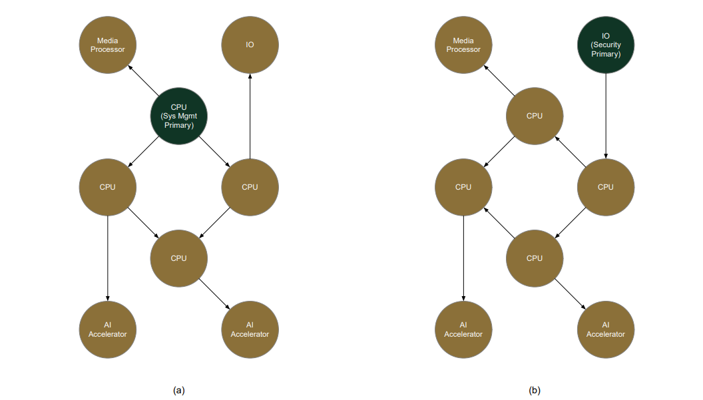
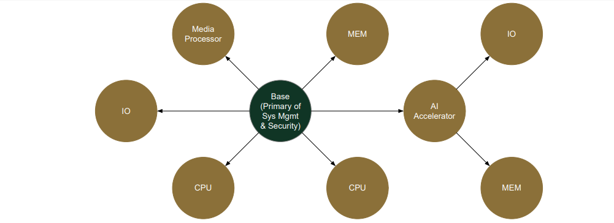

OCAアーキテクチャの基礎
======================
本章では、OCAアーキテクチャにおける基礎的な前提を定義する。

チップレットの役割
------------------

OCAアーキテクチャは階層型システムをサポートし、チップレットはプライマリとセカンダリの異なる役割を担う。
プライマリ・チップレットは特定の機能ドメインにおける主要な制御要素として機能する。
各機能ドメインには通常、パッケージ内に1つのプライマリ・チップレットが存在し、その他のチップレットはすべてセカンダリとして動作する。
割り込みドメインなど、本来プライマリ・チップレットが存在しないドメインもあれば、パッケージ外にプライマリ・チップレットが存在するドメインもある。
後者のケースについては、本ドキュメントの今後の改訂版で扱う。

機能ドメインごとに、プライマリ・チップレットに求められる要件は異なる。以下に、各ドメインが要求するプライマリ・チップレットの特性を定義する。

- ブート・プライマリ: 必要な周エッジインターフェースへのアクセス権を持ち、SiP全体の起動を担う最初の起動チップレット。
- システム管理プライマリ: SiP全体のシステム管理タスクを統括し、システムソフトウェアとインターフェースするチップレット。
- システム時間管理プライマリ: SiPの基準時刻を保持するチップレット。
- セキュリティ・プライマリ: SiPの信頼の根源(RoT)として機能し、SiPの完全性と真正性を保証する。
- 割り込みプライマリ: N/A

  - 相互運用性の観点から割り込みプライマリは存在しない。割り込みは中央制御装置を介さず、ソースから対象チップレットに直接配信される。
- デバッグ・プライマリ: 外部デバッガーとインターフェースし、デバッグトラフィックを他のチップレットへルーティングする。
- DFTプライマリ: チップレットは外部テスターとインターフェースし、テストトラフィックを他のチップレットにルーティングする。
- RASプライマリ: チップレットはエラー集約ツリーの頂点として機能する。
- FuSaプライマリ: チップレットはエラー集約ツリーの頂点として機能する。

図2のベース・チップレットが示すように、単一のチップレットが全機能ドメインでプライマリ・チップレットとして機能することは一般的である。
ただし、SiPインテグレータは異なる機能ドメインごとにプライマリを指定することも可能である。
例えば、セキュリティ/ブート/デバッグ/DFT用と、システム管理/システム時間管理/RAS/FuSa用に別々のプライマリ・チップレットを割り当てる場合などである。

.. tip::
   [OPT-FND-1] SiPの中央コントローラとして機能するチップレットは、関連する全ドメインの主要機能をサポートするよう設計すべきである。

各機能ドメインのプライマリ・チップレット指定はSiPインテグレーターの責任である。この決定にあたっては、SiPの要件とチップレットの機能性を考慮すべきである。

SiP内でチップレットを複数インスタンス化することは珍しくない。この場合、SiPインテグレーターは同一チップレットが、あるインスタンスでは機能ドメインのプライマリとして、別のインスタンスではセカンダリとして機能できるようにする必要がある。

.. tip::
   [OPT-FND-2] チップレットは、マルチインスタンス化をサポートするため、対象となる機能ドメインのセカンダリ機能とインターフェースを備えて設計されるべきである。これにより、SiPインテグレータは各機能ドメインに適したプライマリを柔軟に指定できるようになる。

チップレット・トポロジ
----------------------

パッケージ内のOCAアーキテクチャ準拠チップレットとその接続は、有向非循環グラフを形成する。
グラフの各ノードはチップレットである。エッジはチップレット間の物理的接続を示す。
エッジの方向は一方向または双方向のトラフィックを定義するものではない。代わりに、方向は管理階層を指定する。
有向エッジの方向に沿って、グラフは上流チップレットから下流チップレットへと移動する。
上流チップレットは下流チップレットと同等または上位の管理レベルにある。
以下は、OCAアーキテクチャがトポロジ関連トピックを記述するために使用する用語の一部である。

- ルート: 有向非循環グラフのトポロジルートであり、機能ドメインにおけるプライマリ・チップレットでもある。本ドキュメントではルートとプライマリは互換的に使用される。
- リーフ: 下流チップレットを持たない末端チップレット。
- 非リーフ: 少なくとも1つの上流チップレットと1つの下流チップレットを持つ中間チップレット。
- 上流と下流: チップレットUの上流チップレットとは、チップレットUへの有向パスを持つ全てのチップレットを指す。チップレットUの下流チップレットとは、チップレットUから有向パスを経由して到達可能な全てのチップレットを指す。

トポロジ・ビューはドメイン固有である。機能ドメインのプライマリ・チップレットは、常にその機能ドメインのトポロジ・ビューのルートに位置する。この構造に基づき、管理階層が構築され、ルート付きグラフが定義される。

図5は、あるSiPのシステム管理トポロジ・ビューとセキュリティ・トポロジ・ビューを示す。

   図5. チップレットトポロジの例: 4つのCPUチップレットが対称的に接続され、CPU演算クラスターを形成。アクセラレータおよびIOチップレットは異なるCPUチップレットに接続されている; (a) システム管理のトポロジビューでは、CPUチップレットの1つがプライマリである; (b) セキュリティのトポロジビューでは、IOチップレットがプライマリである。

図6は別のSiPのトポロジビューを示し、中央のベースチップレットがシステム管理とセキュリティの両方におけるプライマリ・チップレットとして機能する。

チップレットトポロジ構成に関する情報は、セクション6.2で定義される標準化されたデータ構造を通じてソフトウェアに提供される。トポロジはパッケージング後に固定されるため、起動時や実行時の検出は不要である。このデータ構造はSiPインテグレータによって提供される。

   図6. チップレットトポロジの例: 全機能ドメインのプライマリ・チップレットとして機能するベースチップレットがSiPの中心に位置する。CPU、アクセラレータ、およびIOチップレットがベースチップレットに接続されている。
   