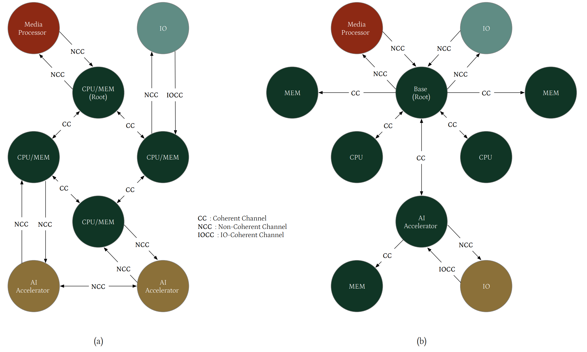
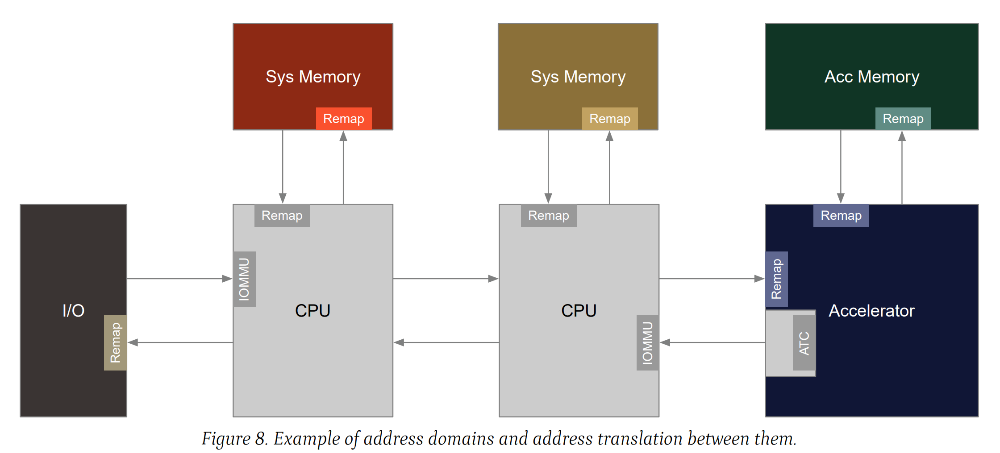
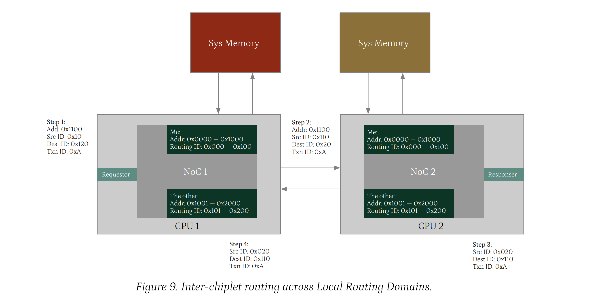
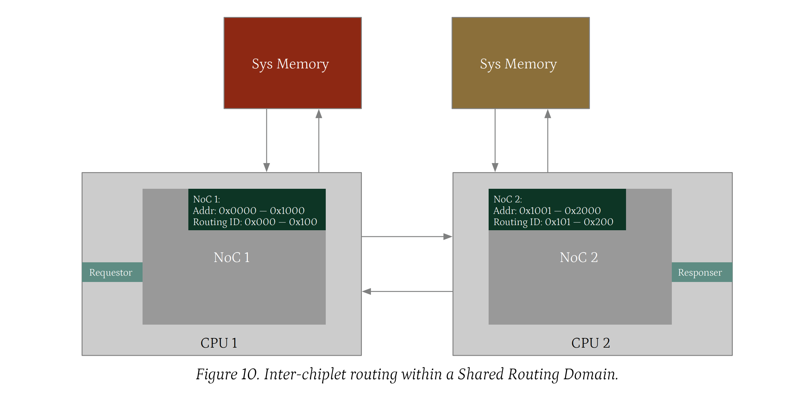
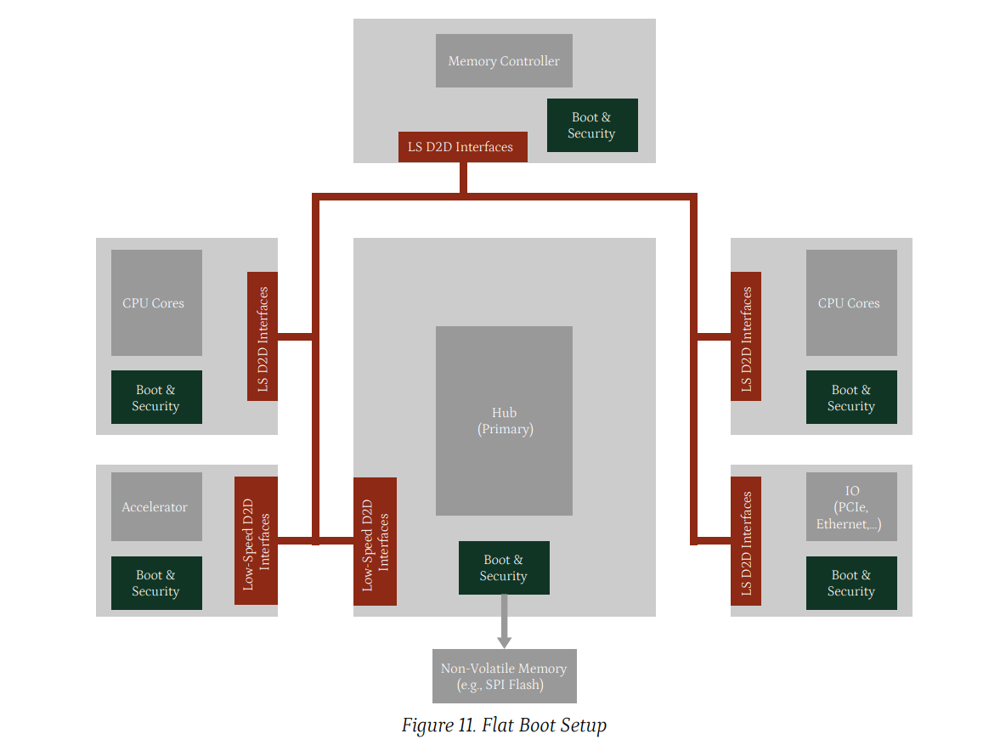
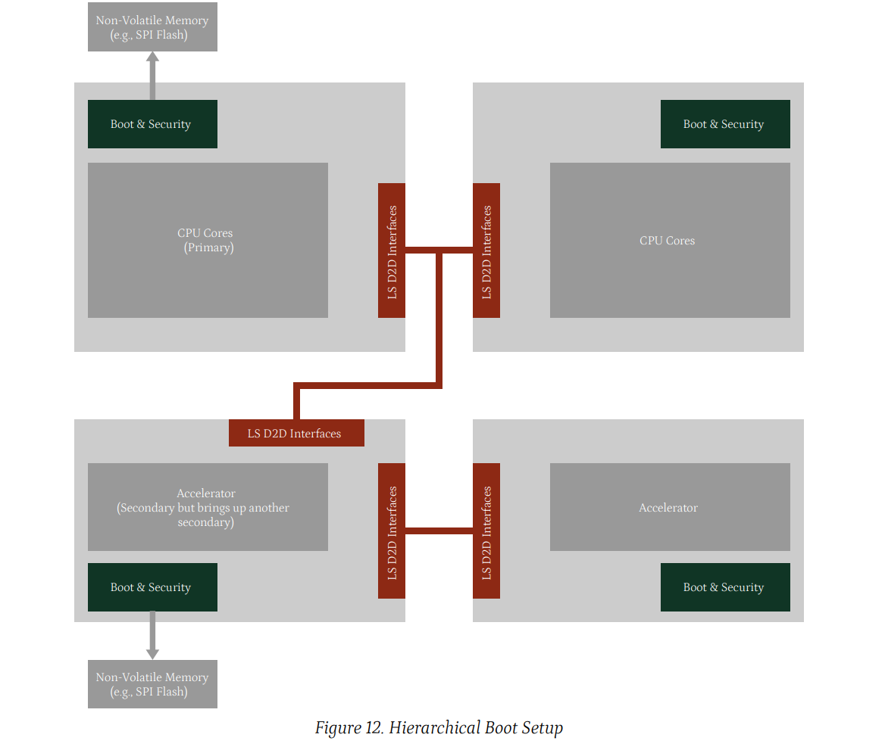
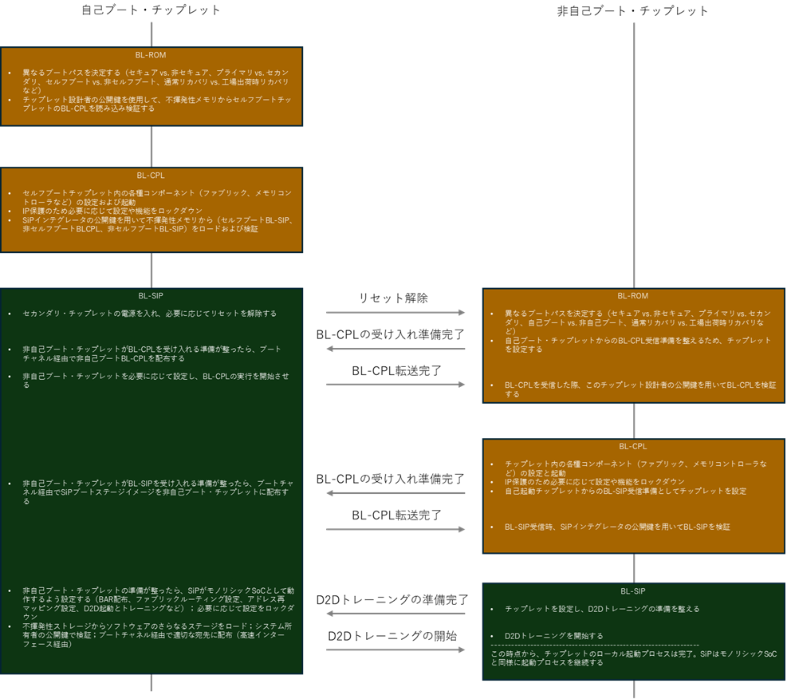
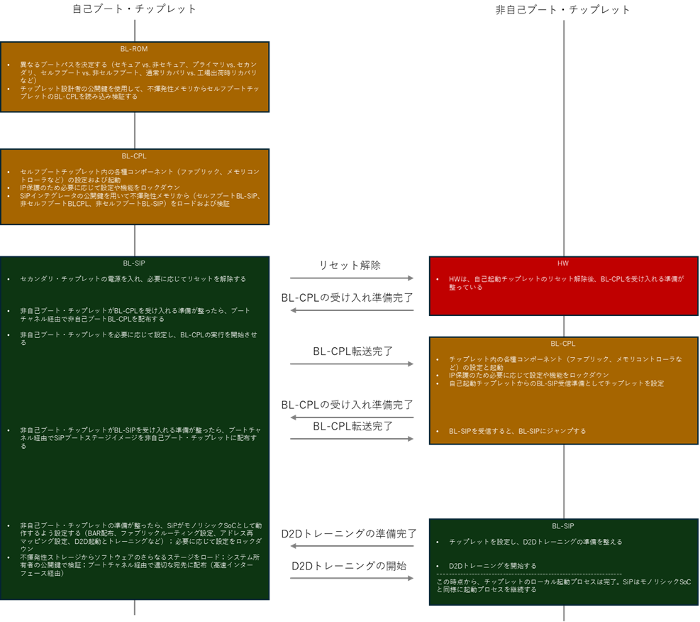

システム層
==========

本章では、システム層における一般的なアーキテクチャを定義する。
OCAアーキテクチャの基本的な機能ドメイン(通信チャネル、アドレス指定、ブート、システム管理、セキュリティ、割り込み、デバッグ設計、テスト設計を含む)を規定する。
さらに、FuSaやRASなどの追加機能ドメインについても規定する。

通信チャネル
------------

OCAアーキテクチャは、抽象化され論理的なチップ間通信経路を記述するためにチャネルを使用する。
本節ではチャネルと対応するアーキテクチャ要件を定義する。
アーキテクチャはチャネルをアプリケーションチャネルと非アプリケーションチャネルに分類する。
アプリケーションチャネルは主要な演算要素と高速I/Oをサポートし、非アプリケーションチャネルはブートやシステム管理などの特定機能に専念する。

チャネルはアーキテクチャ上の概念であり、必ずしも物理的な接続と一致するわけではない。
一部のチャネルは統合され単一の物理接続にマッピングされる場合もあれば、複数の物理接続に分割される必要がある場合もある。
各物理接続は独自のバスプロトコル(例: AXI、CHI)とトランスポート機構(例: UCIe、BoW)で動作する。
詳細は第5章で説明する。

アプリケーションチャネル
^^^^^^^^^^^^^^^^^^^^^^^^

アプリケーションチャネルは、CPU、アクセラレータ、I/Oデバイスなどのコンポーネントを接続し、SiPの機能的目標を達成する。

OCAアーキテクチャでは、アプリケーションチャネルを以下のタイプに分類する: **コヒーレント**、**IO-コヒーレント**、**ノンコヒーレント**。

**コヒーレントチャネル:** メモリ読み取りが常に最新のコピーを取得することを保証する通信経路。
これにより複数のコンピュート・チップレットを相互接続し、コヒーレントなコンピュート・クラスタを形成できる。
チップレットが他ベンダーのチップレットとコヒーレントなコンピュート・クラスタを形成する必要がある場合、他のチップレット上に配置または接続されたキャッシュやシステムメモリを含むメモリ階層にアクセスするために、標準化されたコヒーレント・チャネルを使用する必要がある。
場合によっては、クラスタが同一ベンダーのチップレットのみで構成されることもあり、その場合はベンダー固有の相互接続実装が可能となる。

**非コヒーレントチャネル**: 接続されたコンポーネント間でメモリコヒーレンスを強制しない通信経路。
コヒーレントチャネルとは異なり、メモリ読み取りが常に他のコンポーネントによる最新の書き込みを反映することを保証しない。
非コヒーレントチャネルは通常、複数の演算要素間で厳密なメモリ一貫性が要求されない、またはソフトウェアによって保証されない周辺機器通信やメモリアクセスに使用される。

**IOコヒーレントチャネル**: ソース・チップレットがターゲット・チップレットのメモリ・コヒーレンシ・プロトコルに参加することを可能にする通信経路。
ソース・チップレットがアクセスするデータがターゲット・チップレットのキャッシュおよびメモリとコヒーレントに保たれることを保証する。
これにより、ソース・チップレットは明示的なソフトウェア管理によるキャッシュ・フラッシュや無効化なしに共有メモリの読み書きが可能となる。

図7は、図5および図6のSiP構成例においてアプリケーション・チャネルが実装されている様子を示している。

ラスタを形成。ヘテロジニアス計算クラスタが周辺チップレットにアクセスするには非コヒーレントチャネルを使用。周辺機器はIOコヒーレントチャネルまたは非コヒーレントチャネルを使用してヘテロジニアス計算クラスタおよびシステムメモリと通信する。

   図7. チップレット応用チャネルの例: (a) 4つのCPUチップレットがコヒーレントチャネルで接続され、演算クラスタを形成する。非コヒーレントチャネルは、CPUチップレットクラスタが周辺チップレットにアクセスするために使用される。アクセラレータは非コヒーレントチャネルを使用してシステムメモリにアクセスする。I/OチップレットはI/Oコヒーレントチャネルを使用してシステムメモリにアクセスする;  (b) ベースチップレット、2つのCPUチップレット、AIアクセラレータ、メモリチップレットがコヒーレントチャネル経由で接続され、ヘテロジニアス計算クラスタを形成。ヘテロジニアス計算クラスタが周辺チップレットにアクセスするには非コヒーレントチャネルを使用。周辺機器はIOコヒーレントチャネルまたは非コヒーレントチャネルを使用してヘテロジニアス計算クラスタおよびシステムメモリと通信する。

非アプリケーションチャネル
^^^^^^^^^^^^^^^^^^^^^^^^^^

アプリケーションチャネルに加え、OCAアーキテクチャは以下の非アプリケーションチャネルをサポートする: 

- ブート・チャネル(セクション4.3.4)
- アドレス変換チャネル(セクション4.2.2.1)
- システム管理チャネル(セクション4.4.3)
- システム時間管理チャネル(セクション4.5)
- セキュリティチャネル(セクション4.6)
- 割り込みチャネル(セクション4.7)
- RASチャネル(セクション4.11)
- デバッグチャネル(セクション4.8)
- テストチャネル(セクション4.9)
- FuSaメッセージングチャネル(セクション4.10.2)

これらの非アプリケーションチャネルの詳細は、各ドメイン固有の定義で規定されている。

チップ間デッドロック防止
^^^^^^^^^^^^^^^^^^^^^^^^

ネットワークにおけるデッドロックは、パケットが循環依存関係に陥った際に発生する。
各パケットが進行に必要なリソース(バッファやリンクなど)を解放するために別のパケットを待機し、結果として停止状態に陥る状態を指す。
デッドロックには主に以下の2種類がある: 

1. プロトコル駆動型デッドロック(PDD): 主にプロトコル変換時(チップ種別に関わらず)に発生。
2. トポロジー駆動デッドロック(TDD): チップレット設計時に全体トポロジーや他チップレットが定義される場合。

プロトコル変換はチップレット間インターフェースで発生し、チップレット間トランザクションはチップレット内ファブリックを経由する可能性があるため、以下の基本要件を確立する: 

.. tip::

   [REQ-FABRIC-1] トラフィッククラス間でファブリック内における独立した進行が可能であること。

トラフィッククラスとは、アクセスタイプ、QoS、送信者/受信者、その他のトラフィック属性ごとに異なるトラフィックグループを表す一般的な用語である。
プロトコル変換時には、トラフィッククラスが再マッピング、結合、分離される可能性があるため、特に脆弱な領域が生じる。
このような変換がデッドロックリスクをもたらさないよう、これらの点に特別な注意を払う必要がある。

.. tip::

   [REQ-FABRIC-2] 送信トランザクションは受信トランザクションに依存してはならない。

プロトコル駆動型デッドロックを防止する上記の要件に加え、トポロジーやルーティングに起因するチップ間デッドロックを防止するため、以下の要件が必要である。

.. tip::

   [REQ-FABRIC-3] トランザクションが発信元コンポーネントへ逆戻りする経路(Uターンまたはループバックパスと呼ばれる状態)は禁止される。

議論と設計を簡素化するため、ファブリックは2つのカテゴリに分類される: 

- 非性能重視ファブリック: 高スループットや帯域幅よりも低複雑性接続性を優先する。
- 性能重視ファブリック: 最適な性能提供を主目的とし、スループットと帯域幅に対する要求がより高い。

チップ間トポロジとそのルーティングの究極の目標は、両方のファブリックにおいて非循環であることである。
非性能重視ファブリックは、より単純なトポロジとそれによるルーティングを維持する可能性がある。

.. tip::

   [OPT-FABRIC-1] 非性能重視チップ間トポロジは非循環であるべきである。

トポロジ選択(例: バスまたはツリートポロジ)は、ルーティングデッドロックの主因を回避するため物理的に循環を排除する。
これが不可能な場合、以下の要件に従うこと。

.. tip::

   [REQ-FABRIC-4] 各チップレットは、少なくともターン制限を通じてデッドロック防止機能を提供し、SiPインテグレータへのプログラミングインターフェースを備えること。これによりチップレット間トポロジが非循環となる。

チップ間ルートは、トランザクションがファブリックに注入されてから、遠隔チップ上の最終到達点に到達するまでを意味する。
デッドロック防止のため、SiPインテグレータは以下の3つのプログラミングセグメントを設定する必要がある: 

1. 発信元チップにおいて、SiPインテグレータは送信元からチップ間ポート出口までのチップ間トランザクション経路を設定しなければならない。
2. パススルーチップレット内では、SiPインテグレータはエントリポートから出口ポートへの経路を設定しなければならない。
3. 宛先チップレットでは、SiPインテグレータはトランザクションがエントリポートから最終受信者まで辿る経路を設定しなければならない。

ターン制限とは、複数の経路が存在する中で禁止される経路である。
例えば、物理ポート0からトランザクションが入力される4ポートルータには3つの選択肢(1、2、3)がある。

OCAアーキテクチャは、デッドロック防止の基盤メカニズムとしてターン制限を義務付ける。
チップ間ルーティングとターン制限の両方をプログラミングすることで、SiPインテグレータはデッドロックのないトポロジを確保し、妥当な性能を実現できる。

ただし、負荷分散、QoS、動的再ルーティング、特殊トポロジ対応などの高度な機能は、仮想チャネルやデッドロック検出・回避といったより高度なファブリック機能に依存する。

これらの高度な手法は汎用相互運用性の範囲外であるため、製品固有またはプロファイル固有の基準で定義される。

アドレス指定
------------

アドレスドメイン
^^^^^^^^^^^^^^^^

アドレスドメインとは、メモリやその他のリソースにアクセスするために使用される一連のアドレスの範囲を指す。
単一のチップレットには複数のアドレスドメインが含まれる場合がある。
また、アドレスドメインは複数のチップレットにまたがることもある。
異なるアドレスドメインのアドレスマップは独立しており、異なるドメイン内の同一アドレスが全く異なるリソースを指す可能性があります。

OCAアーキテクチャでは以下のタイプのアドレスドメインをサポートする: 

- **ローカルアドレスドメイン**: 単一チップレットに限定されたアドレスドメイン。
  これによりチップレット設計者は、他のアドレスドメインとの競合を気にせず、そのアドレスマップを独立して定義できる。
  関連するチップレット間トラフィックは異なるアドレスドメインから発生するため、アドレス変換が必要となる。
  SiP内のほとんどのアドレスドメインはこのカテゴリに該当する。
- **共有アドレスドメイン**: 複数のチップレットにまたがるアドレスドメイン。
  参加チップレット間で各アドレスが一意に割り当てられる統一アドレスマップを使用する。
  同一共有アドレスドメイン内のチップレット間通信ではアドレス変換が不要。
  例: 複数のCPUチップレットが共有アドレスドメインに属し、統一アドレスマップ内で各チップレットに重複しないアドレス領域が割り当てられる。

同様に、アドレス変換キャッシュがデバイス・チップレットに統合されている場合、変換されたアドレスを伝送するデバイス・チップレット内のファブリックは、ホスト・チップレットと同じ共有アドレス領域で動作する。

.. tip::

   [REQ-ADDR-1] 各チップレットは、そのアドレス領域をローカル・アドレス領域または共有アドレス領域のいずれかに明確に分類しなければならない。

ローカル・アドレス領域のアドレス幅は実装定義である。

.. tip::

   [REQ-ADDR-2] チプレット間トラフィックが同一共有アドレスドメイン内に留まる場合、そのアドレス幅はプロファイル依存のSAD_ADDR_WIDTHとする。

.. tip::

   [REQ-ADDR-3] 共有アドレスドメインのアドレス空間は2^SAD_ADDR_WIDTHバイトを超えてはならない。

場合によっては、同一ベンダーのチップレットが排他的に共有アドレスドメインを使用することがある。
例えば、複数の同一CPUチップレットを統合して大規模な演算クラスタを形成する場合などである。
このシナリオでは、共有アドレスドメインは独自設計に従うことができ、チップレット間リクエストのアドレス幅とドメインサイズは実装定義となる。

アドレス変換
^^^^^^^^^^^^

アドレス変換により、異なるアドレスドメインに対して独立したアドレスマップ定義が可能となる。

.. tip::

   [REQ-ADDR-4] トラフィックが送信元アドレス領域から宛先アドレス領域へ移動する場合、宛先領域は着信トラフィックのアドレス変換を実行する責任を負う。

.. tip::

   [OPT-ADDR-1] アドレス変換の設定は、ターゲットアドレスドメインで動作するエージェントによって行われるべきである。

このアプローチにより、アドレス領域割り当てに用いられる標準化インターフェース(セクション4.2.3)から、独自仕様のアドレス変換メカニズムを分離できる。
また、変換制御をターゲットドメイン内に隔離することで、セキュリティ強化もサポートする。

.. tip::

   [REQ-ADDR-5] チップ間トラフィックがアドレスドメインを横断する場合、そのアドレス幅はプロファイル依存のD2D_ADDR_WIDTHとする。全てのアドレスビットはアドレス変換に利用可能とする。

アドレスドメイン境界は必ずしもチップレット境界と一致せず、ターゲットアドレスドメインがソースチップレット内に拡張される場合がある。
この場合、ターゲットアドレスドメインのエントリポイントにおけるアドレス変換は物理的にソースチップレット内に配置される。
このシナリオはさらに以下のサブケースに分類できる: 

1. 自立型アドレス変換: 例として、完全機能のIOMMUが独立してアドレス変換を処理する。この場合、D2Dインターフェースを介してターゲットチップレットに伝送されるのは変換済みトラフィックのみである。
2. 非自律型アドレス変換: 例として、PCIeアドレス変換キャッシュのようなTLB類似の変換キャッシュに依存するケース(完全な機能を備えたIOMMUはターゲットチップレットに存在する)。ここではD2D接続が変換済みトラフィックとアドレス変換要求の両方を伝送する。

:numref:`fig08_address_domain` は異なるアドレス領域間でのアドレス変換の例を示す。
2つのCPUチップレットは統一アドレス領域を共有するため、相互のアドレス変換は不要である。
一方、他のチップレットは独立したローカルアドレス領域で動作する。
トラフィックがCPUの共有アドレス領域に入ると、動的アドレス変換はIOMMUによって行われ、静的アドレス変換は再マッピングを通じて処理される。
アドレス領域境界を越えるたびにアドレス変換が発生する。
さらに、CPUの共有アドレスドメインはアクセラレータチップレットまで拡張され、そこにアドレス変換キャッシュ(ATC)が実装されている。
アクセラレータチップレットからCPUチップレットへのメモリアクセストラフィックは既に変換済みであり、ATCはアドレス変換要求をCPUチップレット内のIOMMUに転送する。

.. _fig08_address_domain:

   アドレスドメインの例とそれらの間のアドレス変換。

アドレス変換チャネル
""""""""""""""""""""

アドレス変換チャネルは、アドレス変換、無効化、およびページ要求を処理するために使用される。
アドレス変換チャネルは双方向であり、変換エージェントに変換要求とページ要求を送信し、変換要求者に変換応答とページ要求応答を送信することが可能である。

アドレス変換チャネルのプロパティ
""""""""""""""""""""""""""""""""

アドレス変換チャネルの特性(数量、リセット早期化、可用性、エラー処理など)は使用定義である。
通常、コヒーレントチャネルなどのサポート対象チャネルと同期して定義される。

アドレス領域の割り当て
^^^^^^^^^^^^^^^^^^^^^^

.. tip::

   [OPT-ADDR-2] チップ間D2Dポートには可能な限り大きなアドレス空間を割り当てるべきである。

D2Dポートのアドレス領域割り当ては、静的アドレスマップを持つチップレットにとって極めて重要である。
必要な領域サイズは、D2D接続の反対側に接続される予期せぬチップレットに依存する。
チップレットが接続されたチップレットを収容するのに十分な大きさのアドレス領域をD2Dポートに割り当てない場合、それらのチップレットのリソースを完全に把握できなくなる。
さらに、ターゲットアドレスドメインのエントリポイントにおけるアドレス変換ロジックは、D2D接続の反対側におけるアドレス領域の割り当てを理解できなければならない。

.. tip::

   [REQ-ADDR-6] ソースアドレスドメインにおいてD2Dポートに割り当てられるアドレス領域の数は、4以下でなければならない。

.. tip::

   [REQ-ADDR-7] 送信元アドレス領域のD2Dポートに割り当てられる各アドレス領域は連続していること。

.. tip::

   [OPT-ADDR-3] 送信元アドレス領域のD2Dポートに割り当てられたアドレス領域のベースアドレスは、ブート・チャネル(セクション4.3)を介して、ターゲット領域のアドレス変換ロジックを設定するエージェントに提供されるべきである。

リクエスト-レスポンスペアのチップ間ルーティング
^^^^^^^^^^^^^^^^^^^^^^^^^^^^^^^^^^^^^^^^^^^^^^

チップ境界を横断するチップ間ペアは、送信リクエストと受信レスポンスを含む。
例えば、CPUチップがメモリコントローラチップに対してメモリ読み取りリクエストを発行する場合がある。
このような場合、レスポンスは通常、元のアドレスを省略し、レスポンダが使用するルーティングコンテキストはローカルチップコンテキスト固有である可能性がある。
これにより、いくつかの課題が生じる:

- 応答は元のリクエスト発行者へ戻す必要があるが、必要なルーティングコンテキストがD2Dインターフェースで利用できない場合がある。
- 応答内のアドレス情報不足により、正しい送信元への応答識別と配信が複雑化する。
- チップ間応答ルーティング処理の既存メカニズムは不十分であり、これらの課題解決にはさらなる検討が必要である。

アドレスドメインと同様の概念に基づき、2種類のルーティングドメインが検討される: ローカルルーティングドメインと共有ルーティングドメイン

- ローカルルーティングドメイン: 単一の物理チップレット内に完全に包含され、排他的に管理されるルーティングドメイン。このドメイン内の全コンポーネントは当該チップレット上に存在する。
- 共有ルーティングドメイン: 2つ以上の物理チップレットにまたがる単一の連続したルーティングドメイン。

同一共有ルーティングドメイン内の異なるチップレット上のコンポーネントは、トランザクションがドメイン境界を越える必要なく通信できる。

.. tip::

   [REQ-ADDR-8] 各チップレットは、そのルーティングドメインをローカルルーティングドメインまたは共有ルーティングドメインのいずれかに明確に分類しなければならない。

ドメイン境界を越えたチップ間ルーティング
""""""""""""""""""""""""""""""""""""""""

ローカルルーティングドメインの境界を越える場合、各チップ間リクエストとレスポンスのペアは一意に識別可能かつルーティング可能でなければならない。
リクエストは完全なアドレスやその他のルーティング情報を保持しているため、これは容易である。

しかし、応答には通常、元のアドレスが含まれていないため、要求元への逆ルーティングが困難となる。
この問題を解決するため、チップ間ルーティングコンテキストが導入され、要求と応答のチップ間ペアにおいて必須となる。

**チップ間ルーティングコンテキスト**: チップ間要求とその対応する応答をルーティングするために必要な情報の完全な集合。
このコンテキストは、トランザクションの元の送信元と最終的な宛先を一意に決定するのに十分なものでなければならない。
このコンテキストの表現はプロトコル依存であり、以下の複数の方法で実装される可能性がある: 

- 明示的アドレス指定: コンテキストは、送信元と宛先を識別するための固有のフィールド(例: 送信元IDと宛先ID)を使用して、パケットヘッダーに直接エンコードされる。
- 推測アドレス指定: コンテキストは、一意のトランザクション識別子(例: AXI AWIDまたはARID)によって表される。

ルーティングファブリックは、この識別子を使用してトランザクションの送信元と宛先を内部的に追跡・解決する責任を負う。

明示的または推論的アドレス指定のいずれか一方以上を備えることで、チップ間ペアはローカルルーティングドメイン境界を越えて正しくルーティングされる。
プロトコルは両方式(例: 送信元ID、宛先ID、トランザクションID)をサポートすることを選択できる。
そのNoCは堅牢性向上のため、これら全てまたは一部を採用し得る。

.. tip::

   [REQ-ADDR-9] チップ間トランザクションがローカルルーティングドメインを横断する場合、関連するチップ間ルーティングコンテキストの幅はD2D_ROUTING_WIDTHとする。この値はプロファイル依存かつプロトコル依存である。

.. tip::

   [REQ-ADDR-10] チップ間ペアを転送するチップレットは、ルーティングにチップ間コンテキストを使用し、元の送信元への配信までパケット内でそれが保持されることを保証しなければならない。

チップ間ルーティングコンテキストを保持する方法は、プロトコルとNoC実装に依存する。
例えば、一部のNoCは、チップレットを表すために、送信元IDや宛先IDなどのルーティングコンテキストの特定の領域を予約する。
D2Dインターフェースでは、SiP所有者が設定した構成に基づきこれらのIDが再マッピングされ、チップレット間の正しいルーティングが保証される。
他のNoCでは、AXI IDなどの一意のトランザクション識別子を用いて、各トランザクションの送信元と宛先を内部追跡する場合がある。
このアプローチでは、発信元NoCが各要求に一意のトランザクションIDを割り当て、それが応答として元の要求元に返される際に保持される。
両方のNoCはこのトランザクションIDを使用して、応答を正確に送信元にルーティングする。

:numref:`fig09_routing_domain` は、ローカルルーティングドメイン間のチップレット間ルーティングと、異なるNoC設計におけるルーティングコンテキストの処理を示しています。
一部の実装では、各NoCが他方のNoCをルーティングIDの範囲(すなわちルーティングコンテキスト)として認識する場合がある。
この場合、D2DインターフェースはルーティングIDを静的に再マッピングすることで、2つのルーティングドメイン間で多対多通信を実現する選択が可能である。
別の実装では、一意のトランザクションIDを用いて各トランザクションの発信元と宛先を追跡し、応答を正確に元のリクエスターへルーティングする方式を採用する場合もある。
AXI IDはこの種のトランザクションIDの好例である。

.. _fig09_routing_domain:

   ローカル配線ドメイン間におけるチップ間配線。

共有ルーティングドメインにおけるチップ間ルーティング
"""""""""""""""""""""""""""""""""""""""""""""""""""

システムインパッケージ(SiP)内の同一チップレット複数インスタンスなど、密結合されたチップレット間には効率的なルーティング手法が存在する。
これにより、複雑なクロスドメインルーティングではなく、より直接的でオーバーヘッドの少ないアドレス指定方式を用いた通信が可能となる。

:numref:`fig10_shared_routing_domain` は共有ルーティングドメイン内の2つのCPUチップレット間におけるチップレット間ルーティングの例を示す。
この例では、2つのCPUチップレットが統一されたルーティングドメインを共有し、複雑なチップレット間再マッピングや追跡を必要とせずに直接通信できる。
このようなドメインでは、ルーティングID(すなわちルーティングコンテキスト)は両チップレット上の要求元と応答元によってグローバルに理解される。
アドレスドメインもルーティングドメインと一致する場合、これは従来のモノリシックCPUと非常に類似している。

.. tip::

   [REQ-ADDR-11] 同一共有ルーティングドメイン内に留まるチップ間要求/応答ペアの場合、そのルーティングコンテキスト幅はプロファイル依存かつプロトコル依存のSAD_ROUTING_WIDTHとする。

.. tip::

   [REQ-ADDR-12] 共有ルーティングドメインの総ルーティング空間は、アドレス指定可能なノード数として2^SAD_ROUTING_WIDTHを超えてはならない。

.. _fig10_shared_routing_domain:

   共有ルーティングドメインにおけるチップ間ルーティング

ブート
------

モノリシックSoCと比較して、SiPのブートプロセスでは以下の差異を考慮する必要がある:

- 一部のチップレットはブートに自給自足できず、構成とソフトウェアのロードを他のチップレットに依存する。
- 知的財産やシークレットなどの資産は、異なるエンティティが所有している可能性がある。
- ブートプロセス中にD2D通信を確立する必要がある。

複雑性の増大と複数ステークホルダーの関与により、所有者の責任範囲、チップ間通信インターフェース、ブート段階間のソフトウェアインターフェースを定義する標準化されたブート手順が必要となる。

ブート用SiPセットアップ
^^^^^^^^^^^^^^^^^^^^^^^

自身の設定とソフトウェアをロードできる自立型チップレットは、自己ブート・チップレットと呼ばれる。
これは単独でブートするための能力と必要なシステムセットアップを備えている。
自己ブート・チップレットは、非自己ブート・チップレットへの構成およびソフトウェアのロードを支援することもできる。

.. tip::

   [REQ-BOOT-1] SiPは次のブートセットアップを備えること:

   - ブート・プライマリ・チップレットとして指定されるチップレットは1つだけであること
   - ブート・セカンダリ・チップレットとして構成されるチップレットは0個以上であること
   - チップレット間通信のためのブート・チャネル
 
.. tip::

   [REQ-BOOT-2] ブート・プライマリ・チップレットは、SiP内で最初にブートする自己ブート・チップレットであること。

SiP内でブート・プライマリ・チップレットが唯一の自己ブート・チップレットとなる場合がある。
この場合、ブート・プライマリ・チップレットは全てのブート・セカンダリ・チップレットのブートを管理する。
:numref:`fig11_flat_boot_setup` はこの構成例を示しており、実装定義インターフェース経由で非揮発性メモリを接続した集中型ハブ・チップレットが最初にブートする。
ブート・プライマリ・チップレットとして機能するこのハブ・チップレットは、全てのブート・セカンダリ・チップレットへのソフトウェアまたはデータの構成とロードを担当する。
ブートプロセスの初期段階では、プライマリ・チップレットとセカンダリ・チップレット間の通信は、低速D2D接続上で動作するブート・チャネルを介して行われる。

.. _fig11_flat_boot_setup:

   フラットなブート構成

ブート・セカンダリ・チップレットは自己ブート・チップレットとしても機能し、他のブート・セカンダリ・チップレットのブートを担当できる。
これによりSiP内に多層階層型ブート構造が形成される。 :numref:`fig12_hierarchical_boot_setup` はこの階層型ブート構成を示す。
この例では、アクセラレータチップレットの1つがブート・セカンダリ・チップレットと自己ブート・チップレットの両方として機能し、他のアクセラレータチップレットのブートを担当する。
ブート・プライマリ・CPUチップレットと自己ブート・アクセラレータ・チップレット間の接続は、ブート同期とブート状態報告のために依然として必要である。

.. _fig12_hierarchical_boot_setup:

   階層型ブート構成

.. tip::

   [REQ-BOOT-3] 自己ブート・チップレットは、他のチップレットとの通信にブート・チャネルを使用しなければならない。

.. tip::

   [REQ-BOOT-4] 各ブート・セカンダリ・チップレットは、1つかつ唯一のアップストリーム自己ブート・チップレットに接続しなければならない。

ブート手順
^^^^^^^^^^

.. tip::

   [OPT-BOOT-1] 各チップレットのブート手順には、チップレットブートステージとSiPブートステージを含めること。

- **チップレットブートステージ**: チップレットブートステージの典型的なタスクは、チップレットのローカル設定とファームウェアのロードを完了し、SiPブートステージにおけるさらなるSiPブート準備を整えることである。
   チップレットブートステージには、チップレット専用電源レールの投入、サブシステムリセットの解除、PLLの設定、ローカルファブリックの設定、サブシステム固有の設定などが含まれるが、これらに限定されない。
   チップレット設計者のIP保護(機能や性能制約の強制など)が必要な場合、このタスクもチップレットブートステージで実施する必要がある。
   通常、ブートROMおよびそれに続く可変ソフトウェア段階はこの段階に属する。
   ブートローダROM(BL-ROM)およびBL-ROM直後に実行される可変ソフトウェア(ブートローダチップレット:BL-CPL)は、チップレット設計者によって開発される。
   BL-CPLはチップレット設計者の必要性に応じてオプションとなる。
- **SiPブートステージ**: SiPブートステージの目的には、ローカルチップレット構成の更新、高速チップレット間接続のブート、SiP構成、およびさらなるソフトウェアステージのロードが含まれる。
   SiPブートステージで実行されるソフトウェアはブートローダーSiP(BL-SIP)と呼ばれ、SiPインテグレータによって開発される。

チップレットとSiPブートステージの分割は、チップレットとSiP間の所有権の違いを考慮している。

:numref:`fig13_boot_flow_secondary_requires_secure_boot` は、非自己ブート・チップレットがセキュアブートを義務付けるブート手順の例を示す。
自己ブート・チップレットのBL-SIP、BL-CPL、および非自己ブート・チップレットのBL-SIPはバンドルされ、SiPインテグレータの秘密鍵で署名される。
このバンドル内では、非自己ブート・チップレットのBL-CPLは対応するチップレット設計者の秘密鍵で署名される。

.. _fig13_boot_flow_secondary_requires_secure_boot:

   セキュアブートを要求するブート手順

:numref:`fig14_boot_flow_secondary_doesnt_requires_secure_boot` は、非自己ブート・チップレットがセキュアブートをサポートしていない場合の別のブート手順例を示す。
自己ブート・チップレットのBL-SIP、非自己ブート・チップレットのBL-CPLおよびBL-SIPは、SiPインテグレーターの秘密鍵で署名されバンドルされる。
このバンドル内では、非自己ブート・チップレットのBL-CPLはどの秘密鍵でも署名されない。

.. _fig14_boot_flow_secondary_doesnt_requires_secure_boot:

   セキュアブートを要求しないブート手順

ブート報告
^^^^^^^^^^

ブートトポロジーにおける下流チップレットは、ブート・チャネルを使用してブートステータスを上流チップレットに報告する。
全ての報告は最終的にブート・プライマリ・チップレットによって集約される。
ブート・プライマリ・チップレットは、実装定義インターフェースを通じて、BMCなどのボードレベルコントローラに報告をさらに転送できる。

.. tip::

   [REQ-BOOT-5] ブート報告が必要な場合、それは下流チップレットに保存され、直近の上流自己ブート・チップレットが利用可能とする。

.. tip::

   [REQ-BOOT-6] ブート・セカンダリ・チップレットは、ブート報告が利用可能になった際に、ブート・チャネルを使用して直近の上流自己ブート・チップレットに通知しなければならない。

.. tip::

   [REQ-BOOT-7] 上流自己ブート・チップレットは、ブート・チャネル経由でブート報告を取得しなければならない。上流自己ブート・チップレットがブート・プライマリ・チップレットでない場合、ブート・チャネルを通じて直近の上流自己ブート・チップレットに通知しなければならない。

レポートの場所は設定データとして提供される。詳細はセクション6.2を参照のこと。

ブート・チャネル
^^^^^^^^^^^^^^^^

.. tip::

   [REQ-BOOT-8] ブート・チャネルは、電源とクロックが供給された時点で、設定不要ですぐに使用可能であること。

「設定不要」という表現は、ブート・チャネルが他のチャネルに依存せずに設定可能な最も初期のチャネルの一つであることを強調するためである。
実際には、いくつかのストラップやGPIOピンが有効であるが、鶏と卵の問題を避けるため厳密な定義を選択する。

.. tip::

   [REQ-BOOT-9] ブート・チャネルは、チップレット間のデッドロック回避を簡素化するため、共有非循環トポロジーで開始しなければならない。

.. tip::

   [REQ-BOOT-10] ブート・チャネルは、自己ブート・チップレットとその非自己ブート・チップレット間の通信を可能にしなければならない。

システム管理
--------------

システム管理には、システム状態管理、電力管理、性能管理、リセット管理、クロック管理、ハザード管理などが含まれる。
OCAアーキテクチャは、:numref:`fig05_topology_example1` および :numref:`fig06_topology_example2` に示すように、階層的なシステム管理構造を採用する。

.. tip::

   [REQ-SM-1] 各チップレットは、チップレットレベルの管理タスクを処理するため、システム管理コントローラ(SMC)を実装しなければならない。
   SMCは物理的に独立したコンポーネントでも、他のサービスと物理リソースを共有するサービスでもよい。

.. tip::

   [REQ-SM-2] システム管理プライマリ・チップレット内のSMC(プライマリSMC)は、最上位レベルの管理タスクも処理しなければならない。

.. tip::

   [REQ-SM-3] 共有電圧レールの電圧制御など、複数のチップレットにまたがる管理タスクは、チップレット・トポロジの該当部分において最上位に位置する関連するSMCによって管理されなければならない。

.. tip::

   [REQ-SM-4] SMCは相互通信にシステム管理チャネルを使用する。

この階層的管理方式により、OSなどのシステム・ソフトウェア・エージェントがシステム管理リソースと直接やり取りすることを防ぐ。
また、あるチップレットが別のチップレット内のシステム・リソースを管理する必要性を排除する。
この階層的アプローチはシステム・ソフトウェアに対して透過性を保ち、モノリシックSoCと同様のフラットなビューを提供する。
システム管理プライマリ・チップレットはシステム・ソフトウェアの中央インターフェースとして機能し、全ての通信を処理するとともに、下流のSMCやローカルシステム管理リソースへのタスク委譲を行う。

システム管理ソフトウェアとプライマリSMC間のインターフェース
^^^^^^^^^^^^^^^^^^^^^^^^^^^^^^^^^^^^^^^^^^^^^^^^^^^^^^^^^^^^^^

メッセージング・プロトコル標準は、システム管理ソフトウェアとプライマリSMC間の抽象化レイヤとして使用できる。
例えば、RISC-VアーキテクチャはRISC-Vプラットフォーム管理インターフェース(RPMI)を定義し、ARMアーキテクチャはシステム制御管理インターフェース(SCMI)を定義する。

.. tip::

   [REQ-SM-5] システム管理ソフトウェアを実行するチップレットは、システム管理プライマリ・チップレットとして指定される。

これにより、システム管理ソフトウェアとプライマリSMC間のインターフェースはチップレット内インターフェースとなるため、セカンダリSMCはCPUアーキテクチャに依存しない。

SMC間通信
^^^^^^^^^^

SMCは次の目的を達成するために通信する:

- システムソフトウェアコマンドを下流SMCに配布する。
- システムソフトウェアコマンドへの応答として、下流SMCからの応答を上流SMCに転送する。
- 下流SMCからのテレメトリデータ及び状態変化通知を上流SMCへ伝送する。
- テレメトリ設定、制御ループ予算、ハザード制御コマンド、その他の管理指示を下流SMCへ送信する。

システム管理ファームウェアの相互運用性を確保するには、標準化されたファームウェア通信インターフェースが不可欠である。
本アーキテクチャではこの要求に対応するため、オープン・チップレット管理インターフェース(OCMI)を定義する。
OCMIの定義はセクション6.1で説明する。

システム管理チャネル
^^^^^^^^^^^^^^^^^^^^

システム管理チャネルは、SMC間通信を促進しSiP構成をサポートするために設計されたアーキテクチャチャネルである。
システム管理チャネルは以下の特性を有するものとすること:

.. tip::

   [REQ-SM-6] 各チップレットは、チップレット間管理通信のために常に利用可能なシステム管理チャネルを有すること。

システム時間管理
---------------------

モノリシックSoCと比較して、SiPは異なるチップレットに分散したシステム・タイマを持つ可能性が高い。
分散したシステム・タイマを同期させる仕組みが必要である。

システム・タイマはソフトウェアで使用できる。
デバッグでタイムスタンプを生成するためにも使用できる。
比較すると、ソフトウェアは通常、同期精度に対してより高い要求を持ち、異なるシステム・タイマから読み取る際に時間逆転が生じないことを求める。

同期プロトコルの詳細はセクション5.2.5で説明する。

システム時間カウンタ
^^^^^^^^^^^^^^^^^^^^^

.. tip::

   [REQ-TM-1] 各システム・タイマはシステム時間カウンタを備え、64ビットのアップカウンタとして機能しなければならない。

.. tip::

   [REQ-TM-2] システム時間管理プライマリ・チップレット内のシステム時間カウンタは、プロファイル依存の周波数 SYS_TIMER_FREQ で動作する。カウントステップは 1 である。

.. tip::

   [REQ-TM-3] システム時間管理セカンダリ・チップレット内のシステム時間カウンタは、整数で除した周波数 SYS_TIMER_FREQ で動作する。カウンティングステップは周波数分割値とする。

周波数分割値は1(分割なし)でもよいが、システム・タイム・セカンダリ・チップレットでは分割値が1より大きい場合が一般的である。

.. tip::

   [REQ-TM-4] システム・タイムカウンタは、システム・タイム管理チャネルを用いて同期を取得しなければならない。

